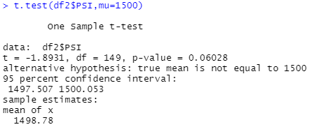
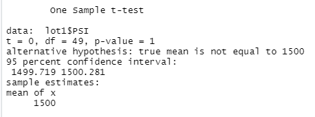
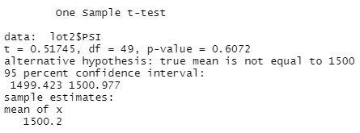
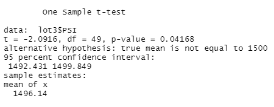

# MechaCar_Statistical_Analysis

## Linear Regression to Predict MPG

### Which variables/coefficients provided a non-random amount of variance to the mpg values in the dataset?

vehicle_length and ground_clearance have effects on mpg, because the p-value is less than 0.05. 

### Is the slope of the linear model considered to be zero? Why or why not?

The overall p-value is  5.35e-11, which is less than 0.05.
Therefore, we can state that there is sufficient evidence to reject our null hypothesis, which means that the slope of our linear model is not zero

### Does this linear model predict mpg of MechaCar prototypes effectively? Why or why not?

Not really. Not all variables contribute to mpg. Some coefficient has p-value larger than 0.05. 

## Summary Statistics on Suspension Coils

The design specifications for the MechaCar suspension coils dictate that the variance of the suspension coils must not exceed 100 pounds per square inch. 
The current manufacturing data overall meets this design specification because the variance is 62.3<100. 
However, lot3 does not meet the specification with variance equal to 170.3. 

### Total Summary

### Lot Summary

## T-Tests on Suspension Coils

### Overall PSI

Ho: the mean of PSI is 1500

H1: the mean of PSI is not 1500

P-value is larger than 0.05. We do not have enough evidence to say that the the mean of PSI is not 1500.

the PSI across all manufacturing lots is not statistically different from the population mean of 1,500 pounds per square inch.

### PSI for different lots

#### Lot 1

Ho: the mean of PSI for lot1 is 1500

H1: the mean of PSI for lot1 is not 1500

P-value is larger than 0.05. We do not have enough evidence to say that the the mean of PSI for lot1 is not 1500.

the PSI for lot1 is not statistically different from the population mean of 1,500 pounds per square inch.

#### Lot 2

Ho: the mean of PSI for lot2 is 1500

H1: the mean of PSI for lot2 is not 1500

P-value is larger than 0.05. We do not have enough evidence to say that the the mean of PSI for lot2 is not 1500.

the PSI for lot2 is not statistically different from the population mean of 1,500 pounds per square inch.

#### Lot 3

Ho: the mean of PSI for lot3 is 1500

H1: the mean of PSI for lot3 is not 1500

P-value is less than 0.05. We have enough evidence to say that the the mean of PSI for lot3 is not 1500.

the PSI for lot3 is statistically different from the population mean of 1,500 pounds per square inch.

## Study Design: MechaCar vs Competition

### What metric or metrics are you going to test?

I will test highway fuel efficiency and horse power, concerning with performance.

### What is the null hypothesis or alternative hypothesis?

There are two tests below:

Ho: The fuel efficiency is the same for cars from different manufacturers
Ha: At least one manufacturers have different fuel efficiency from others.

Ho: The horse power is the same for cars from different manufacturers
Ha: at least one manufacturers have different horse power from others.

### What statistical test would you use to test the hypothesis? And why?

I will use ANOVA test, because the data of cars from multiple manufacturers will be collected.

And after ANOVA, if I reject Ho, I will apply Tukey HSD test to see the details.

### What data is needed to run the statistical test?

The horse power data and fuel efficiency from different manufacturers are required to be collected.  
