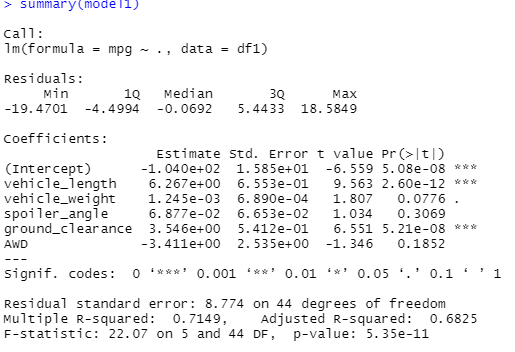
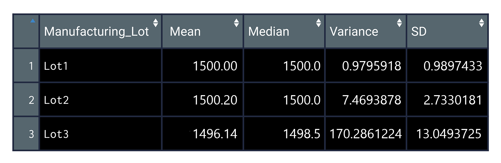

# MechaCar_Statistical_Analysis

## Linear Regression to Predict MPG

### Which variables/coefficients provided a non-random amount of variance to the mpg values in the dataset?

vehicle_length and ground_clearance have effects on mpg, because the p-value is less than 0.05. 

### Is the slope of the linear model considered to be zero? Why or why not?

The overall p-value is  5.35e-11, which is less than 0.05.
Therefore, we can state that there is sufficient evidence to reject our null hypothesis, which means that the slope of our linear model is not zero

### Does this linear model predict mpg of MechaCar prototypes effectively? Why or why not?

Not really. Not all variables contribute to mpg. Some coefficient has p-value larger than 0.05. 

## Summary Statistics on Suspension Coils

The design specifications for the MechaCar suspension coils dictate that the variance of the suspension coils must not exceed 100 pounds per square inch. 
The current manufacturing data overall meets this design specification because the variance is 62.3<100. 
However, lot3 does not meet the specification with variance equal to 170.3. 

### Total Summary

### Lot Summary

